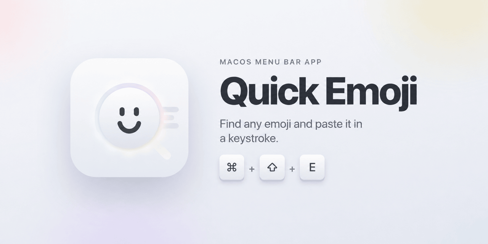

# QuickEmoji



Find and insert emoji and special characters with a global keyboard shortcut on macOS.

## Install

### Homebrew

```bash
brew trust --cask smnandre/tap/quickemoji
brew install --cask smnandre/tap/quickemoji
```

### Direct download

Download the DMG from the [latest release](https://github.com/smnandre/QuickEmoji/releases/latest), open it, then drag `QuickEmoji.app` to `Applications`.

## Usage

### The picker - ⌘⇧E

Press **⌘⇧E** anywhere. A floating panel opens near the top-center of the active screen.

- Type to filter
- Arrow keys to navigate
- **Enter** to insert the selected character
- **Shift-Enter** to insert and keep the picker open
- **Command-A** to select all typed search text
- **Control-click** or **right-click** to copy
- **Escape** or **Tab** closes the picker; so does any click outside it

Search understands English Unicode names and shortcodes, with French Unicode CLDR short names and aliases when macOS uses French.
Country flags also match their two-letter codes, such as `fr`, `de`, or `jp`.

## First launch and Accessibility permission

QuickEmoji requires **Accessibility** access for the global shortcut, locating the text cursor, and inserting the selected character. macOS prompts for access on first launch:

> System Settings → Privacy & Security → Accessibility → QuickEmoji

QuickEmoji keeps emoji usage and per-app ranking data on your Mac. It sends no emoji history or focused-field content. The manual update check reads the published Homebrew cask. There is no telemetry.

## Menu-bar dropdown

Click the menu-bar icon for:

- **Show Picker (⌘⇧E)** - same as the shortcut
- **Check for Updates…** - checks the published Homebrew cask once
- **Settings…** - configure whether QuickEmoji launches when you sign in.

## Requirements

- macOS 26 or later
- Apple silicon

## Build from source

```bash
git clone https://github.com/smnandre/QuickEmoji.git
cd QuickEmoji

make verify
make run
```

## Contributing

Contributions are welcome. Run `make verify` before opening a pull request.

## License

QuickEmoji is released by [Simon André](https://smnandre.dev) under the [MIT License](LICENSE).
